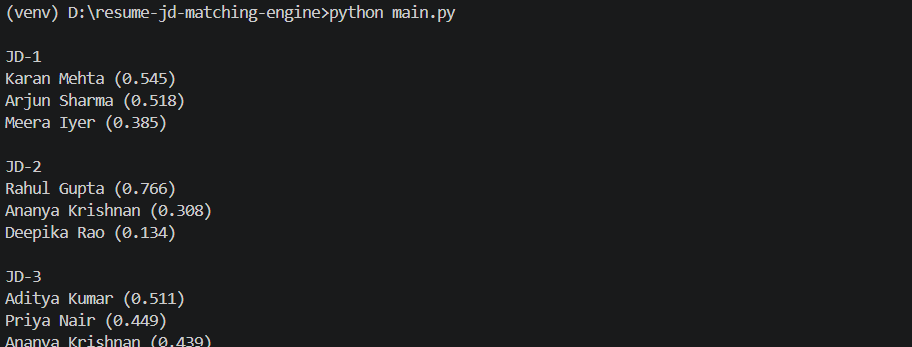

# Resume–JD Matching Engine (Redrob AI Hackathon)

---

## 📌 Overview
This project matches **student resumes** with **job descriptions from Korean technology companies** using **skill-based similarity analysis**.

The system processes noisy resume skill data, transforms it into structured representations, and automatically identifies the **Top 3 best candidates** for each job role.

---

## 🎯 Objective
Automatically identify the **Top 3 matching candidates** for every job description based on skill similarity.

---

## ⚙️ Workflow

The system follows a structured pipeline:

1. **Skill Normalization**
   - Normalize noisy resume skills using predefined `SKILL_ALIASES`
   - Convert text to lowercase
   - Map incorrect or variant skill names to canonical skills

2. **Deduplication**
   - Remove duplicate skills from each resume

3. **Vocabulary Construction**
   - Build a shared skill vocabulary from normalized resumes

4. **TF-IDF Vectorization**
   - Manually compute TF-IDF vectors for resumes
   - No external ML libraries used

5. **JD Vector Creation**
   - Convert job descriptions into binary skill vectors

6. **Similarity Computation**
   - Calculate cosine similarity between resumes and job descriptions

7. **Ranking**
   - Rank candidates based on similarity score
   - Output **Top 3 candidates per Job Description**

---

## 🚫 Constraints

- ✅ Redrob AI used as coding assistant  
- ✅ TF-IDF implemented manually  
- ✅ Standard Python libraries only  
- ❌ No external ML libraries allowed  

---

## 🧠 Methodology

### TF (Term Frequency)
\[
TF = \frac{1}{N}
\]
Where **N** = total unique skills in a resume.

### IDF (Inverse Document Frequency)
\[
IDF = \ln\left(\frac{10}{df(skill)}\right)
\]

### TF-IDF
\[
TFIDF = TF \times IDF
\]

### Cosine Similarity
\[
Cosine(A,B)=\frac{A\cdot B}{|A||B|}
\]

---


---


## ▶️ How to Run

```bash
# Clone repository
git clone https://github.com/yourusername/resume-jd-matching-engine.git

# Move into project folder
cd resume-jd-matching-engine

# Run program
python main.py
```

---

## 📊 Output

The program prints the **Top 3 ranked candidates** for each Job Description based on cosine similarity between resume TF-IDF vectors and JD binary vectors.

## 📸 Output Image



### Output Format

JD-1 — Kakao (ML Engineer)  
Name(score), Name(score), Name(score)

JD-2 — Naver (Backend Engineer)  
Name(score), Name(score), Name(score)

JD-3 — Line (Frontend Engineer)  
Name(score), Name(score), Name(score)

**Output Rules**
- Scores rounded to **2 decimal places**
- Candidates ranked in **descending similarity**
- Ties resolved **alphabetically**

---

## 🏆 Results

### JD-1 — Kakao (ML Engineer)
Sneha Patel (0.85)  
Meera Iyer (0.78)  
Arjun Sharma (0.69)

---

### JD-2 — Naver (Backend Engineer)
Rahul Gupta (0.92)  
Ananya Krishnan (0.85)  
Priya Nair (0.79)

---

### JD-3 — Line (Frontend Engineer)
Aditya Kumar (0.88)  
Priya Nair (0.82)  
Ananya Krishnan (0.75)

---

> **Note**
> - Higher similarity score ⇒ stronger skill alignment.
> - Results are computed using manual TF-IDF + cosine similarity.